## Foreword

Since many years I am using JDownloader as the solution to download things on all my computers.
The problem with it is though that the files are not synchronized between them.
Thus I cannot access what I downloaded from any machine different from the original downloader.
This problem worsens even with the fact that once I am not at home, I cannot access the harddrives the multimedia is on.

What bugs me about JDownloader though is that there is no CLI application nor a WebUI, unless you want to rely on their external [MyJDownloader](https://my.jdownloader.org/) service.
But I wanted to find a way that enables me to run JDownloader on a headless RaspberryPi.
The JDownloader should be accessible via browser, yet selfhosted.

## Prerequisites

I only tested this on a RaspberryPi 4 with 8 GB of RAM running [Ubuntu Server 21.04](https://ubuntu.com/download/raspberry-pi/thank-you?version=21.04&architecture=server-arm64+raspi).
It could be that the Raspbery Pi 3 is too weak for this, but feel free to give it a try.
Therefore I assume you are running on a Debian based distribution.
All not-containerized programs we need to build the multimedia station is [Docker](https://www.docker.com/) and [ZeroTier](https://www.zerotier.com/).

### Installation of Prerequisites

To build this setup, we are using

* Docker
* ZeroTier
* [MisterDerpie/jdownloader-docker](https://github.com/MisterDerpie/jdownloader-docker)
* [Docker-Apache/httpd](https://hub.docker.com/_/httpd).

We need to install Docker and ZeroTier (the latter needs to be set up) before starting, the other two components will be touched later on.

### Docker

Installing Docker on the RaspberryPi is straightforward.

```bash
curl https://get.docker.com/ | sh
```

After the installation, you need to be add your user to the `docker` group.

```bash
sudo usermod -aG docker $USER
```

Once this is done, reboot or logout and login.
Verify that the installation was successful by running `hello-world`.

```bash
docker container run --rm hello-world
```

### ZeroTier

This section describes how to setup ZeroTier on the RaspberryPi.
This is solely for accessing it from anywhere.
In case you don't want to access the Pi from outside the same network which it is running in, you can skip this section.
The IP address will then be your Pi's local IP address.

As straightforward as it is to install Docker, the same it is for ZeroTier.
Yet we need more steps to do it.

#### Create ZeroTier Account

Go to [ZeroTier.com](https://zerotier.com/) and click on `Sign Up` to create an account.
It is free and you don't need any premium plan.

#### Create a ZeroTier Network

On the same page, go to `Log In`.
After logging in, you should be redirected to [my.zerotier.com](my.zerotier.com]).
Click on `Create Network`.

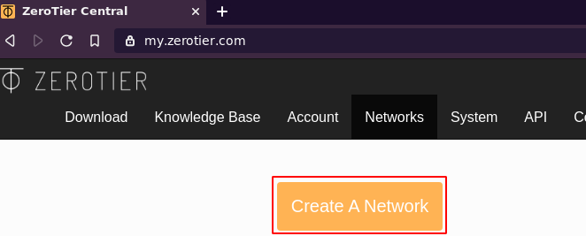

You should see a table with the new created network.

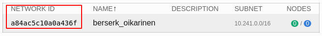

Click anywhere on the row to go to the network configuration.
The network can be named as you want.
**Important**: Ensure that it is marked as private.

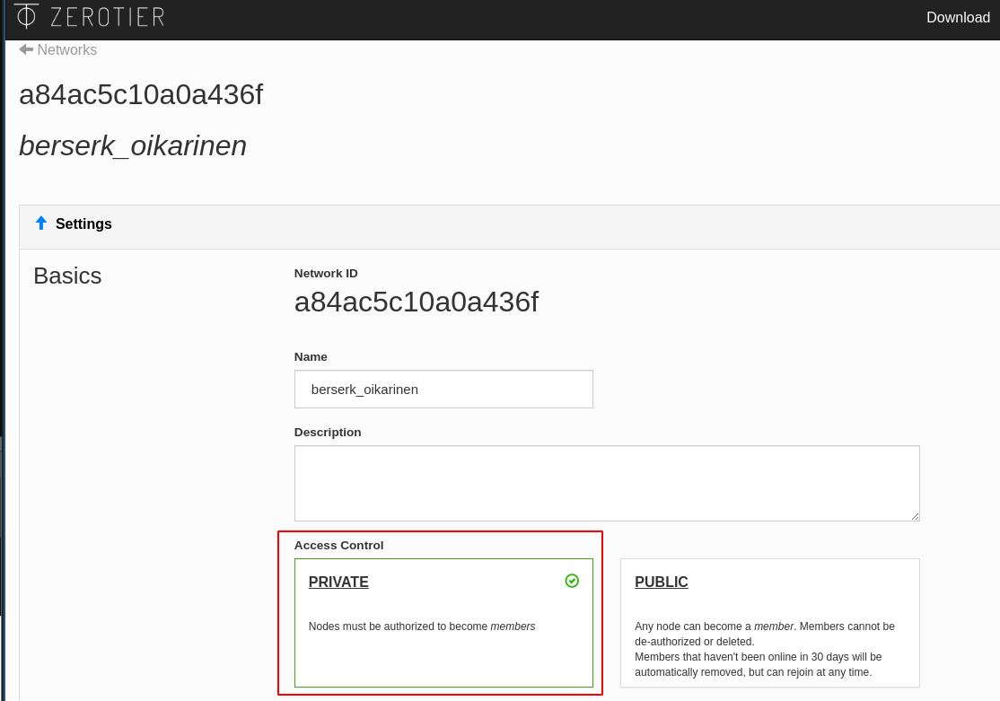

This will prevent any other user who may guess your network ID from being able to access it directly.
Scroll down to the `Advanced` section and select any of the auto-assign IP addresses from the range in the lowest row.
I selected `192.168.195.*`, so this tutorial will continue assuming you're in the same range.

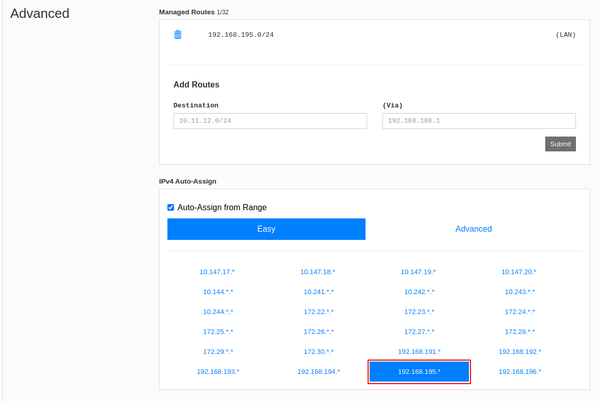

If you scroll further to the `Members` section, you should see that no devices have joined this network yet.

#### Join ZeroTier Network with Raspberry Pi

To join a network, we need the network ID.
This can be found in the yellow box stating `No devices have joined` in a way of `join <NetworkId>`.
You can join via `zerotier-cli` command.
My networkid is `a84ac5c10a0a436f`, so I run the following.

```bash
sudo zerotier-cli join a84ac5c10a0a436f
```

When the command ran successful, the console output should be `200 join OK`.
After some seconds you should be able to see the first member in the `Members` box.

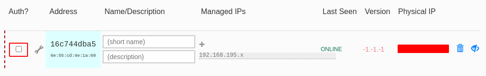

To get it assigned an IP address in the virtual ZeroTier network, we need to check the `Auth?` box.
Unless you check this, the device will not be part of this network and cannot communicate with others.
I also recommend you to give it a name, for example `RaspberryPi`.

We are done. ZeroTier is set up and installed on our RaspberryPi.
As the yellow box warns us, there should be at least two devices.
Of course, the other devices should be the hostmachines we want to access the RPi from.

#### Join ZeroTier Network from another machine

##### Linux

In case your host machine is a Debian based Linux machine, you can install ZeroTier the very same as done for the RaspberryPi.
The only step you need to do after installation is joining the previously created network.

##### Windows

On Windows, download the [ZeroTier One.msi](https://download.zerotier.com/dist/ZeroTier%20One.msi) installer and install it.
Start `ZeroTier` from the program menu.
Then you should see the icon in the tray (where the speaker symbol is in the taskbar).


In case you don't see it, click on the arrow next to the speaker.
Then click on the icon and click `Join Network ...`.

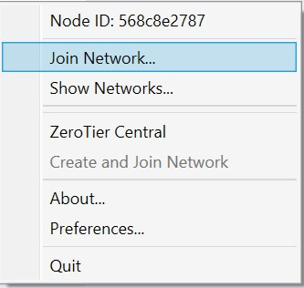

Enter the network's id and click `Join`.

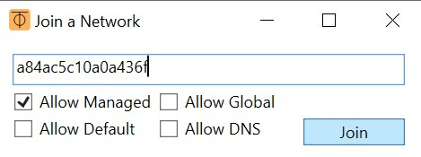

After a short time Windows should ask you whether you want your computer to be discoverable.
Select `Yes`.

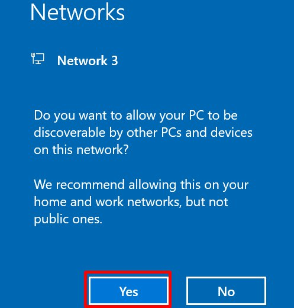

##### Final Step

Once you have joined the network from your host machine, don't forget to go back to the webinterface and authorize your device.
Again, I recommend you to also name it.
See the screenshots from `Join ZeroTier Network with RaspberryPi` how to authorize and name it.

## JDownloader-Docker

The JDownloader-Docker image enables you to run JDownloader and access the UI via any browser.
This image has minor JDownloader preconfiguration.
If you are interested in the details, check the [repository](https://github.com/MisterDerpie/jdownloader-docker).
To do so, we first need to clone the repo and then build the image.

```bash
git clone https://github.com/MisterDerpie/jdownloader-docker
```

Go into the root of the directory.
From there, build the image named `jd2-base`.

```bash
docker build -t jd2-base .
```

This process will take some time.
Once it's done, congratulations: You are now having a JDownloader base image.
We will not extend the image but use it to run our container.

### Create Download Directory

Create a folder in your home directory that is called `jdownloader-root`.

```bash
mkdir ~/jdownloader-root/
```

Go in that directory and create 2 directories, `Downloads` and `Extracted`.

```bash
mkdir Downloads
mkdir Extracted
```

### Start JDownloader

The webinterface to JDownloader is accessible on port `8080`.
We can link it to any port on the Pi, yet we will use the same port.
Make sure you are in the `jdownloader-root` directory and the directories `Downloads` and `Extracted` exist.
Then, let's start our JDownloader container.

```bash
docker container run -d \
    -p 8080:8080 \
    -v "$(pwd)/Downloads":/Downloads \
    -v "$(pwd)/Extracted":/Extracted \
    --name jdownloader \
    jd2-base
```

This may also take some time.
Once it's done you should see the ID of the container being printed.

#### What does this do?

We start the `JDownloader` container with the name `jdownloader` and link it's `Downloads` and `Extracted` directory to the ones in `~/jdownloader-root/`.
As I mentioned, the image is preconfigured, so everything that is downloaded will land in `Downloads`.
In case it's an archive, it will be extracted to `Extracted` and the archives will be deleted.

Note: This container is not configured to startup on boot again.
You'd have to run `docker container start jdownloader` after a reboot.

### Connect to JDownloader

This section only works if you set up ZeroTier.
Go to the ZeroTier Webinterface and find out the IP Address of the RaspberryPi.

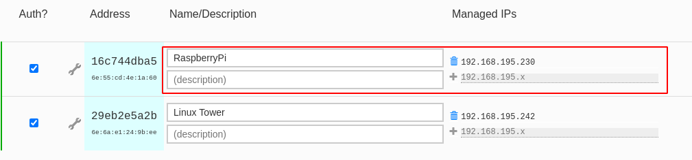

As you can see, the IP of my RaspberryPi is `192.168.195.230`.
To connect to JDownloader, open `<yourip>:8080/vnc.html` in your browser.
So in my case, I go to `192.168.195.230:8080/vnc.html`.
Click `Connect`, and there it is.
We see JDownloader running and open in the browser.

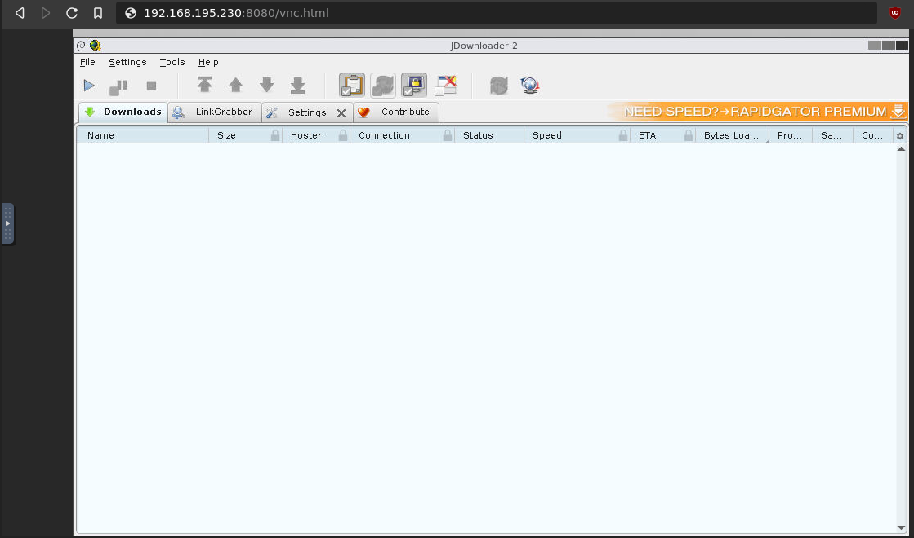

## Apache Webserver for File Access

We are almost good to go.
Now JDownloader downloads and extracts files for us.
We can also access them by accessing the Pi, but how can we access them from e.g. [VLC](https://www.videolan.org/)?

I present you a very basic and rudimentary way of providing them via [Docker-Apache/httpd](https://hub.docker.com/_/httpd).
You will be able to access the files via browser by simply putting in the Pi's IP address.

**Note**: This only works when you store all files in either `Downloads` or `Extracted` directories.
In case you followed this guide, this applies.

### Create `index.html`

To be presented with a link to your JDownloader WebUI, as well as the `Downloads` and `Extracted` folder selection on the landing page, go to `~/jdownloader-root/`.
There create a file called `index.html` and add the following content.

```html
<!DOCTYPE html>
<head>
    <title>Server</title>
</head>
<body>
    <a href="" id="jdownloader">JDownloader</a><br/>
    <a href="./Downloads/">Downloads</a><br/>
    <a href="./Extracted/">Extracted</a>
    <script>
        document.getElementById('jdownloader').href = window.location.protocol + "//" + window.location.hostname + ":8080/vnc.html";
    </script>
</body>
```

### Start the Webserver

Go into the `~/jdownloader-root/` directory.
From there, start the webserver.

```bash
docker container run -d --name webserver \
    -p 80:80 \
    -v "$(pwd)":/usr/local/apache2/htdocs/ httpd
```

It starts on port `80` (the default port) containing the entire directory.
When you go to your browser and navigate to your Pi's IP address (in my case `192.168.195.230`) you will be presented the landing page.
There you can select whether you want to browse the `Downloads` or `Extracted` directory.
Moreover can you also go to `JDownloader` directly from the landing page.

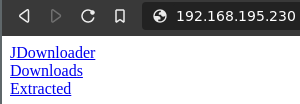

Clicking on e.g. `Downloads` gives you an index of the files/folders contained in it.

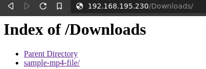

## Bottom Line

That's already it 🎉.
You're now running a fully remote accessible Multimedia Station on your Raspberry Pi.
As mentioned, all the containers are not configured to start on the Pi's startup.
So once you reboot your RaspberryPi, you would have to run the following.

```bash
docker container start jdownloader
docker container start webserver
```

There are several guides available online on how to make a container start on boot.
This can for example be achieved by executing `docker run` with the `--restart=always` parameter or [making it a service in systemd](https://blog.container-solutions.com/running-docker-containers-with-systemd).

## Additional Content

We have JDownloader downloading and extracting, can access it from anywhere and also access the files via browser.
Yet two topics should be visited to make it fully worth.
The first is how we get containers & links into JDownloader.
Second topic is about how to stream downloaded content in VLC.

### Add DLCs or Links to JDownloader

To add links, you can use the clipboard from the sidebar.
Click on the sidebar icon.

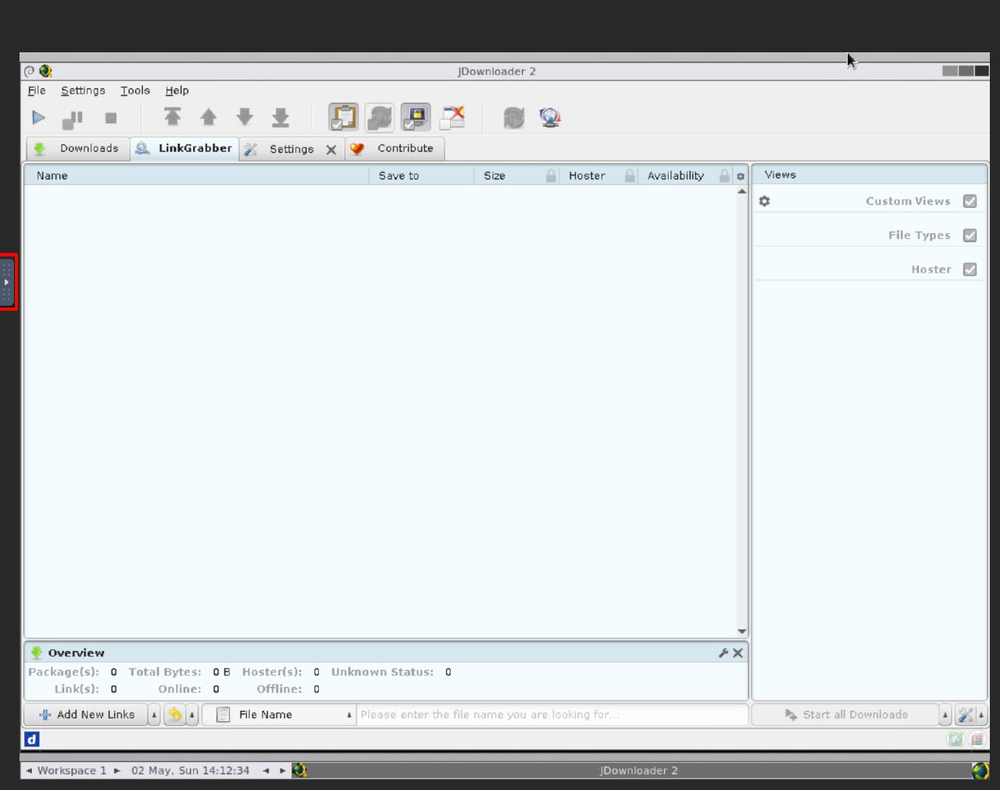

Next, open the cliboard.

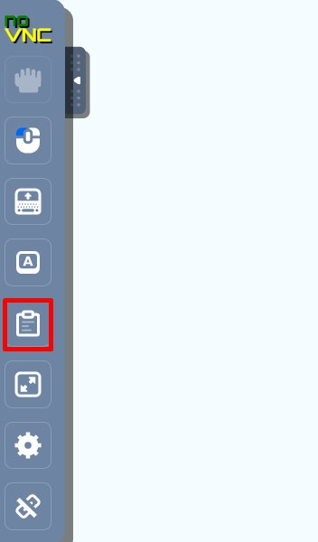

Then paste your links in the clipboard.
Make a right-click somewhere in the LinkGrabber field.
Select `Paste Links` and the linkgrabber should start gathering them.

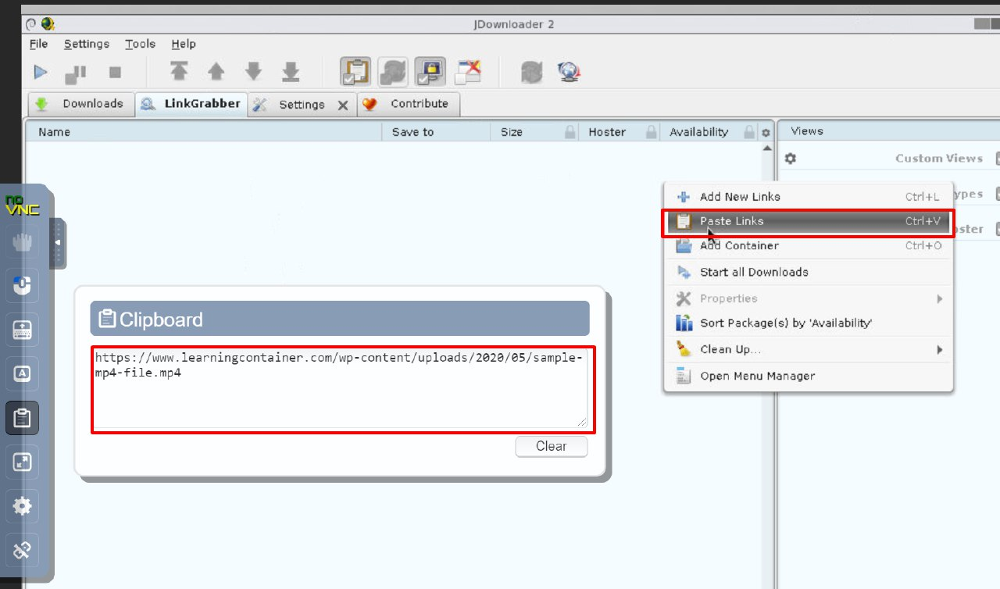

To get DLCs to JDownloader, you can simply put them in the `Downloads` or `Extracted` directory.
Do so by e.g. transfer them to the Pi first (e.g. via `ssh`) and then open them via `File -> Load Linkcontainer`.
The docker image additionally offers the volume `/containers` where you can place them in, but I didn't use it in this post. 
This could be used in addition to running for instance a `FileZilla` container for that directory.

### Stream to VLC Media Player

As many people use JDownloader to download multimedia files, it would be good having acces to them in VLC player.
Open the webui.
From there navigate to the file you want to stream.
Make a right click on the file and copy it's link address.

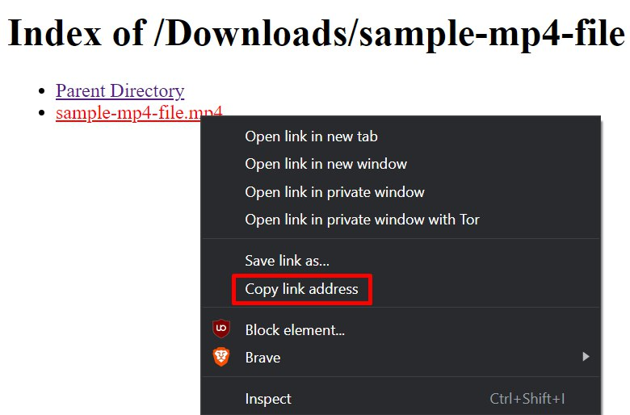

Then go to VLC and click on `File -> Open Network Stream ...`.

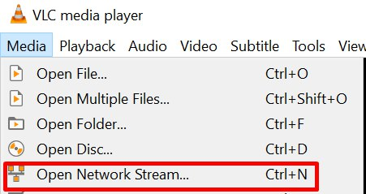

Paste the link there and click on `Play`.

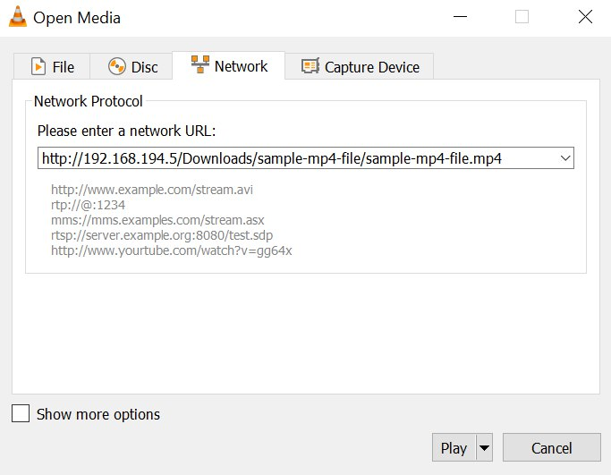

VLC should now start playing your selected video.