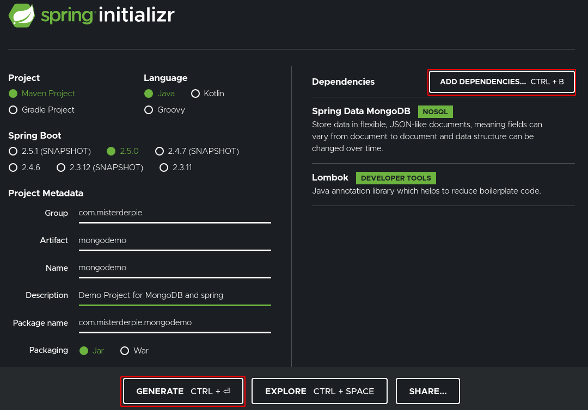

The sourcecode of this post is available on [github/MisterDerpie/spring-boot-with-mongodb](https://github.com/MisterDerpie/spring-boot-with-mongodb).

# Foreword

For a small application to store receipts I wanted to use [Spring Boot](https://spring.io/projects/spring-boot) and NoSQL database [MongoDB](https://www.mongodb.com/).
As with many basic topics in the spring world, there is a [Getting Started guide](https://spring.io/guides/gs/accessing-data-mongodb/) on [spring.io](https://spring.io), with the specific title "Accessing Data with MongoDB".

Though this guide may suffice for a really straightforward start, it actually misses out two, from my point of view, essential questions.

1. How to connect to a MongoDB instance?
2. How to integration test MongoDB?

Therefore I wrote this post.
As I want to use JavaMoney, I also cover Mongo Converters.
The list explains what is covered in this post.

* Use MongoDB as a data store in Spring
* Connect to a MongoDB instance with your provided credentials
* Integration test with an embedded MongoDB
* Use [JavaMoney](https://javamoney.github.io/) with MongoDB

# Setup MongoDB

First we need an instance of MongoDB.
I will - as usual - use [Docker](https://www.docker.com/).
Therefore I assume you have docker installed, if not, there are plenty of guides how to do that available online.
We use the [Docker-Mongo](https://hub.docker.com/_/mongo) image.
To start a MongoDB instance that is running in the background, run below code from the shell.

```bash
docker container run -d \
    --name mongodb \
    -e MONGO_INITDB_ROOT_USERNAME=admin \
    -e MONGO_INITDB_ROOT_PASSWORD=admin \
    -p 27017-27019:27017-27019 \
    mongo:latest
```

# Setup Spring Boot Project

## Create Spring Project

This section is about creating the Spring project. 
After you created the project, don't forget to add the additional dependencies (next section).

### Create project with Spring Initializr

The easiest way to create the project is using [Spring Initializr](https://start.spring.io/).
I will use [Gradle](https://gradle.org/) as the build automation tool, but it doesn't matter and you can well select Maven.

We will include the 2 starters

* Lombok
* Spring Data MongoDB



To do so, click on `Add Dependencies` (top right corner) and search for `Spring Data Mongo DB` (don't use the reactive one) and `Lombok`.

Select that you want to have a `Gradle Project`, use `Java`, fill out the `Project Metadata`, select `Packaging Jar` and `Java 11`.
Then click `Generate` and you should get a `.zip` containing your project.
Unzip this anywhere and open it in the IDE of your choice.
I prefer [IntelliJ](https://www.jetbrains.com/idea/).

### Create project with Gradle

In case you want to create your Gradle project from scratch, you can follow [docs.gradle.org - Building Java Applications Sample](https://docs.gradle.org/current/samples/sample_building_java_applications.html).
Add below dependencies to your `dependencies` block in the `build.gradle` file.

```
implementation 'org.springframework.boot:spring-boot-starter-data-mongodb'
implementation 'org.springframework.boot:spring-boot-starter-web'
compileOnly 'org.projectlombok:lombok'
annotationProcessor 'org.projectlombok:lombok'
testImplementation 'org.springframework.boot:spring-boot-starter-test'
```

## Additional Dependencies

To show how to integration test and how to use JavaMoney with MongoDB, we add two dependencies, namely [Flapdoodle Embedded MongoDB](https://github.com/flapdoodle-oss/de.flapdoodle.embed.mongo) and [JavaMoney](https://javamoney.github.io/).
Add
```
testImplementation 'org.springframework.boot:spring-boot-starter-test'
testImplementation 'de.flapdoodle.embed:de.flapdoodle.embed.mongo:3.0.0'
implementation 'org.javamoney.moneta:moneta-core:1.4.2'
```
to your dependencies in the `build.gradle` file. It should then look similar to this.
```
dependencies {
	implementation 'org.springframework.boot:spring-boot-starter-data-mongodb'
	compileOnly 'org.projectlombok:lombok'
	annotationProcessor 'org.projectlombok:lombok'
	testImplementation 'org.springframework.boot:spring-boot-starter-test'
	testImplementation 'de.flapdoodle.embed:de.flapdoodle.embed.mongo:3.0.0'
	implementation 'org.javamoney.moneta:moneta-core:1.4.2'
}
```

# Connect Application to MongoDB

This part only covers how to configure your application to be able to connect with MongoDB.
I assume you have a MongoDB instance running configured the same way as I did with the docker image.
That is, listening on port `27017`, with user `admin` and password `admin`.
Note that you should not use those credentials in a real application of course, but for only running this on your local machine and getting started this is perfectly fine.

In the `resources` folder (where the `application.properties` resides), create a new properties file called e.g. `application-production.properties` and put the following content in it.

```
spring.data.mongodb.authentication-database=admin
spring.data.mongodb.username=admin
spring.data.mongodb.password=admin
spring.data.mongodb.database=testdatabase
spring.data.mongodb.port=27017
spring.data.mongodb.host=localhost
```

This enables Spring's MongoDB repository to

* connect to a MongoDB instance running on `localhost`
* with port `27017`
* and username `admin`
* and password `admin`
* and selected database `testdatabase`
* and authentication database `admin` (default in the docker container)

## Why not the default application.properties? 

You may wonder why we don't use the default properties file.
The reason is that the embedded MongoDB for some reason does not override these values.
In case you run your integration tests without providing a profile and/or not providing these values, it would fall back to the default properties file.
Thus the tests would fail, as you could not connect to the database.

For the sake of completion, before your tests even start you would see this error.
```
org.springframework.beans.factory.BeanCreationException: Error creating bean with name 'embeddedMongoServer'
```

# Create Mongo Document in Application

The next part is to create a [MongoDB document](https://docs.mongodb.com/manual/core/document) representation class.
Simply put, this is the entity you are going to persist in the database.
We keep it simple and want to store an `Item` we purchased.
Its values are an `id`, a `name` and a `price`.
We will use the `id` as the primary key.

Create a class called `Item` with the following contents.

```java
import lombok.AllArgsConstructor;
import lombok.Data;
import org.javamoney.moneta.FastMoney;
import org.springframework.data.annotation.Id;
import org.springframework.data.mongodb.core.mapping.Document;

import java.util.UUID;

@Document
@AllArgsConstructor
@Data
public class Item {

    @Id
    public UUID id;
    public FastMoney price;
    public String name;
    
}
```

Let's explain a bit what's going on here.

* `@Document` indicates that we want this class to be persistable in MongoDB.
In case you are familiar with JPA, this is the equivalent to `@Entity`.

* `@AllArgsConstructor` and `@Data` are Lombok annotations.
The former one creates what it states, a constructor with all parameters.
With the latter we automatically create getters and setters.

* `@Id` marks this field as the primary key to use in the database.

# Use MongoRepository to access Document

The next step is that we want to store our document in the database.
Spring provides a very easy to use interface for that.
Just create a class called `ItemRepository` that extends `MongoRepository<T, ID>`.

```java
import org.springframework.data.mongodb.repository.MongoRepository;

import java.util.UUID;

public interface ItemRepository extends MongoRepository<Item, UUID> {

}
```

The first generic parameter of `MongoRepository` indicates what entity we want to persist.
As our `Item` is the entity, we put this there.
To identify items, we set the primary key of type `UUID`.
Therefore we put the ID type as the second generic parameter.

# Integration Test MongoDB

We are done, almost.
Let us test our `MongoRepository` whether it works as expected (hint, it doesn't, but we will get to that).

## Create the test

Create a test class `ItemRepositoryTest` with the following content

```java
import org.javamoney.moneta.FastMoney;
import org.junit.jupiter.api.Test;
import org.springframework.beans.factory.annotation.Autowired;
import org.springframework.boot.test.autoconfigure.data.mongo.DataMongoTest;

import java.util.UUID;

import static org.assertj.core.api.Assertions.assertThat;

@DataMongoTest
public class ItemRepositoryTest {

    @Autowired
    ItemRepository itemRepository;

    @Test
    public void shouldStoreItem() {
        Item item = new Item(UUID.randomUUID(), FastMoney.of(1, "EUR"), "Test Item");
        itemRepository.save(item);
        Item storedItem = itemRepository.findById(item.getId()).orElseThrow();
        assertThat(storedItem.getId()).isEqualTo(item.getId());
        assertThat(storedItem.getPrice()).isEqualTo(item.getPrice());
        assertThat(storedItem.getName()).isEqualTo(item.getName());
    }
}
```

Let us look at what's done here, before we run the test.

`@DataMongoTest` starts the Spring Boot Test context. In addition to that it also creates an embedded MongoDB instance.

`@Autowired` "injects the dependency" of `ItemRepository` into the test class.
Simply put, Spring creates an instance of `ItemRepository` and puts the reference to that instance in `itemRepository`.
So `itemRepository` is not null, and the creation of it is done by Spring's Dependency Injection container.
If you want to to read more about it click on the links for [@Autowired](https://www.tutorialspoint.com/spring/spring_autowired_annotation.htm) and [Spring Dependency Injection](https://docs.spring.io/spring-framework/docs/3.2.x/spring-framework-reference/html/beans.html).

The test itself then is pretty simple.
We create an Item with a random UUID, value of 1 euro and the name "Test Item".
Then we store this in the database and try to query the database for the item ID, asserting that the retrieved item is equal to the initial item.

## Run the test

When we try to run the test, it will even fail before the first assertion is reached.
Looking at the logs, we can see the following error.

```
Failed to instantiate org.javamoney.moneta.FastMoney using constructor NO_CONSTRUCTOR with arguments
org.springframework.data.mapping.model.MappingInstantiationException: Failed to instantiate org.javamoney.moneta.FastMoney using constructor NO_CONSTRUCTOR with arguments
...
```

The problem is the internal representation of `FastMoney`. When serialized into a JSON object, it actually does not just look like
```json
{ "number": 1, "currency": "EUR" }
```
but like
```json
{"currency":{"context":{"providerName":"java.util.Currency","empty":false},"numericCode":978,"defaultFractionDigits":2,"currencyCode":"EUR"},"number":1.00000,"precision":1,"factory":{"defaultMonetaryContext":{"fixedScale":true,"maxScale":5,"amountType":"org.javamoney.moneta.FastMoney","precision":19,"providerName":null,"empty":false},"amountType":"org.javamoney.moneta.FastMoney","maxNumber":92233720368547.75807,"minNumber":-92233720368547.75808,"maximalMonetaryContext":{"fixedScale":true,"maxScale":5,"amountType":"org.javamoney.moneta.FastMoney","precision":19,"providerName":null,"empty":false}},"context":{"fixedScale":true,"maxScale":5,"amountType":"org.javamoney.moneta.FastMoney","precision":19,"providerName":null,"empty":false},"zero":false,"positive":true,"negative":false,"negativeOrZero":false,"positiveOrZero":true,"scale":5}
```
But FastMoney does only have a constructor that accepts these very two parameters.
The solution is to provide a custom converter, that would store our money representation exactly as what the constructor expects.

# MongoDB Converter

## Create Converters

To successfully save and load our Item from the database, we need to convert the price.
This is done by creating a `ReadingConverter` and a `WritingConverter`.
Create two classes, namely `FastMoneyReadConverter` and `FastMoneyWriteConverter` with the following contents.

```java
import org.javamoney.moneta.FastMoney;
import org.springframework.core.convert.converter.Converter;
import org.springframework.data.convert.ReadingConverter;

import java.math.BigDecimal;

@ReadingConverter
public class FastMoneyReadConverter implements Converter<String, FastMoney> {

    public FastMoney convert(String input) {
        String[] storedValue = input.split("###");
        return FastMoney.of(new BigDecimal(storedValue[0]), storedValue[1]);
    }

}
```

```java
import org.javamoney.moneta.FastMoney;
import org.springframework.core.convert.converter.Converter;
import org.springframework.data.convert.WritingConverter;

@WritingConverter
public class FastMoneyWriteConverter implements Converter<FastMoney, String> {

    public String convert(FastMoney input) {
        return input.getNumber() + "###" + input.getCurrency();
    }

}
```

Our converters implement the `Converter<Input, Output>` interface.
The naming states exactly what we want to achieve with them.
With a ReadingConverter, we want to convert when _reading from_ the database _into_ the Java Object.
A WritingConverter is used when we _write into_ the database _from_ the Java Object.

What the converters do is very straightforward.
We take the values from the Money, concatenate them with a placeholder of three hashtags and then save this entire string to the database.
On reading from the database, we revert that operation by splitting them at the three hashtags and creating a FastMoney instance of the two obtained values.

## Create Converter Config

We created our converters but need to make the MongoRepository aware of using them when storing/loading documents from MongoDB.
For that, we simply create a configuration and provide a list of `MongoCustomConversions`.

```java
import org.springframework.context.annotation.Bean;
import org.springframework.context.annotation.Configuration;
import org.springframework.data.mongodb.core.convert.MongoCustomConversions;

import java.util.List;

@Configuration
public class ConverterConfig {

    @Bean
    public MongoCustomConversions mongoCustomConversions() {
        return new MongoCustomConversions(List.of(new FastMoneyReadConverter(), new FastMoneyWriteConverter()));
    }
}
```

`@Configuration` loads this class in the Spring context.

`@Bean` tells Spring to get an instance of the return type (here: `MongoCustomConversions`) by calling this method.
In the `mongoCustomConversion` method we pass a list of our converters to the constructor of `MongoCustomConversions` and return that.

# Integration Tests Revisited

Let's try running our integration tests again.
Now that we have the converters in place, we should be good to go, right?
No. Unfortunately our tests will fail for the very same reason again.

Why is that?

When running with `@DataMongoTest`, it does not scan for the `ConverterConfig`.
That is why we need to include this in the Spring context in this test.
This is easily done by adding `@Import(ConverterConfig.class)`.

Our test should finally look like this and pass

```java
import org.javamoney.moneta.FastMoney;
import org.junit.jupiter.api.Test;
import org.springframework.beans.factory.annotation.Autowired;
import org.springframework.boot.test.autoconfigure.data.mongo.DataMongoTest;
import org.springframework.context.annotation.Import;

import java.util.UUID;

import static org.assertj.core.api.Assertions.assertThat;

@DataMongoTest
@Import(ConverterConfig.class)
public class ItemRepositoryTest {

    @Autowired
    ItemRepository itemRepository;

    @Test
    public void shouldStoreItem() {
        Item item = new Item(UUID.randomUUID(), FastMoney.of(1, "EUR"), "Test Item");
        itemRepository.save(item);
        assertThat(storedItem.getId()).isEqualTo(item.getId());
        assertThat(storedItem.getPrice()).isEqualTo(item.getPrice());
        assertThat(storedItem.getName()).isEqualTo(item.getName());
    }
}
```

Congratulations, you successfully wired Spring with MongoDB.