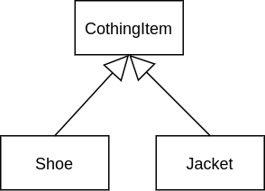
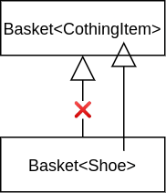
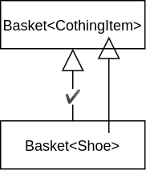
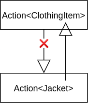
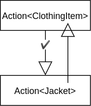

In my previous post I stated that I am currently reading [Kotlin in Action](https://www.manning.com/books/kotlin-in-action) (2017, Manning).
In chapter 9, the authors introduce generics in Kotlin.
My overall experience with generics in Java is good, but apparently that book taught me something completely new.
The concept of [Covariance and Contravariance](https://en.wikipedia.org/wiki/Covariance_and_contravariance_(computer_science)) was something unknown to me.
This post, though categorized Kotlin, focuses more on the concepts in general, yet will demonstrate them in Kotlin.
I assume the reader has a basic understanding of generics and inheritance.

# Inheritance for normal Classes

Before we get into generics, let us look into inheritance for normal classes.
For that, consider the following class hierarchy.



```kotlin
abstract class ClothingItem(val price: Float)
class Shoe(price: Float, val size: Float) : ClothingItem(price)
class Jacket(price: Float, val hasZipper: Boolean) : ClothingItem(price)
```

Between `Shoe` and `Jacket` there is no relationship in terms of "Shoe _is-a_ Jacket" or "Jacket _is-a_ Shoe".
Thus, whenever we expect a shoe, we cannot treat it as a jacket and vice versa.
But between `ClothingItem` and `Shoe`/`Jacket`, there is in fact an _is-a_ relationship.
Shoes and jackets are both clothing items.
Hence we can always use a `Shoe` or `Jacket` in code when we expect a `ClothingItem`.

```kotlin
fun printPrice(item: ClothingItem) {
    println("The item costs ${item.price}.")
}
```

We can call that with either shoe or jacket.

```kotlin
// The item costs 5.
printPrice(Shoe(5f, 33.5f))

// The item costs 20.
printPrice(Jacket(20f, false))
```

# Covariance

To explain how inheritance in generics works, and the word "covariance", I want to do that by an example.

## Domain Model

We create a `Basket` where we can put exactly 2 of any clothing item.
Also we define a function to print the total price of the items in the basket.

```kotlin
class Basket<T : ClothingItem>(val firstItem: T, val secondItem: T)
fun printBasketPrice(basket: Basket<ClothingItem>) {
    val firstPrice = basket.firstItem.price
    val secondPrice = basket.secondItem.price
    val total = basket.firstItem.price + basket.secondItem.price
    println("The total price of $firstPrice + $secondPrice = $total.")
}
```

Now, assume we only want to buy shoes, so we create a basket only containing shoes.
This saves us from accidently putting a jacket into the basket.
We then want to print its price, using the previously defined function.

```kotlin
val shoeBasket = Basket<Shoe>(Shoe(5.5f, 37.5f))
printPrice(shoeBasket)
```

When we try to run this, it won't compile, because the types are not matching.

## Basket\<Shoe\> not is-a Basket\<ClothingItem\>

This is strange.
We know that Shoe is-a ClothingItem, and wherever we expect the latter, we could actually provide the former.
It turns out that `Basket<Shoe>` is not a `Basket<ClothingItem>`.



Even though the inner types are in an is-a relationship with each other, in the generic world this does not apply.
Why is that?

It is best shown by changing the basket to be able to replace items, i.e. change `val` to `var`.
Now we add a function that is able to replace the first clothing item by one that is provided.
This won't compile, but if it would, the program would crash at the print.

```kotlin
class Basket<T : ClothingItem>(var firstItem: T, var secondItem: T)
fun replaceFirstItem(basket: Basket<ClothingItem>, item: ClothingItem) {
    basket.firstItem = item
}

//... called from some other place
val basket = Basket<Shoe>(Shoe(1f, 2f), Shoe(3f, 4f))
replaceFirstItem(basket, Jacket(5f, false))
// The print causes the program to crash
// Basket<Shoe> now holds a Jacket, and Jacket has no size property
println("The shoe has size ${basket.firstItem.size}.")
```

And that is the reason why the is-a relationship for generics is not safe to treat the same way as for normal classes.
It is unsafe for a function that expects a more generic type to pass a more specific one.

But if we could not do that, this would limit us by a lot.
You've seen the function to print the price of the basket.

```kotlin
fun printBasketPrice(basket: Basket<ClothingItem>) {
    // ...
}
```

If we would not be able to do that, we would have to create the same function for each type of clothing.
That may be possible, but neither keeps your code [DRY](https://en.wikipedia.org/wiki/Don%27t_repeat_yourself) nor would it be feasible if you had hundreds of items.

## Definition of Covariance

The previous can be achieved with covariance.
Formally defined:

```
Given a class with a generic parameter: SomeClass<T>.
We say SomeClass<A> is-a SomeClass<B> if A is-a B, and that SomeClass<T> is covariant on T.
```

Informally speaking, the "normal object inheritance" holds.
Thus the covariant basket inheritance diagram looks like the following.



## Covariance in Code

Covariance exactly solves our problem.
But how do we achieve that in code?
And, if we enable that, would we run into the same problem that we could maybe override values with the wrong type?

In Kotlin, you define covariance on T using the keyword `out`.

```kotlin
// Note, we use val again
class Basket<out T : ClothingItem>(val firstItem: T, val secondItem: T)

// ... call it
val basket = Basket<Shoe>(Shoe(1f, 2f), Shoe(3f, 4f))
println("The shoe has size ${basket.firstItem.size}.")
```

The keyword is not coincidantelly named `out`, it actually has a specific reason.
When you mark the generic parameter as covariant, you can only use an instance of T in out positions.
This does probably introduce another questionmark, because what are out positions?
Informally said, an out position is everything that is returning, but never receiving.
An instance of T could be acquired by getting from the basket, because the getter would _return_ the instance.
An operation like setting a variable to an instance would not be allowed, because the setter would _receive_ the instance.

With that said, with a covariant basket, we could never run into overriding an item with a wrong instance.
How should we?
The operation to write is a receiving operation, thus not an out operation.
This is also the reason we have to define the items as `val` instead of `var`.
As `var` provides setters, it wouldn't compile.

# Contravariance

Covariance is a concept that is quite natural, because it follows the "normal flow" of inheritance.
What is way less natural is the concept of contravariance, because it allows you to walk "upwards" in the inheritance tree - kind of.

## Adding an Action Object

Let's create an abstract base class that supports a single function, provided two objects, and returns nothing.

```kotlin
abstract class Action<T> {
    abstract fun performAction(firstItem: T, secondItem: T): Unit
}
```

For contravariance we want to work with a basket full of jackets.
So we create an action specific to jackets.

```kotlin
class JacketAction : Action<Jacket>() {
    override fun performAction(firstItem: Jacket, secondItem: Jacket) {
        if (firstItem.hasZipper && secondItem.hasZipper) {
            println("Both jackets have zippers!!!")
        } else {
            println("You have at least one non-zipper jacket.")
        }
    }
}
```

## Call Action on printing

Let's create a method that takes a basket full of jackets and an action for jackets.
Also we create a jacket basket and call the method with it and the previously defined jacket action.

```kotlin
fun printComplimentAndPerformAction(basket: Basket<Jacket>, action: Action<Jacket>) {
    println("Nice jackets!")
    action.performAction(basket.firstItem, basket.secondItem)
}

// ... in the caller

val jacketBasket: Basket<Jacket> = Basket(Jacket(1f, false), Jacket(2f, false))
val jacketAction = JacketAction()
printComplimentAndPerformAction(jacketBasket, jacketAction)
/* Output
Nice jackets!
You have at least one non-zipper jacket.
*/
```

## More general action

Say we want to have an action we can perform on any clothing item.
That is a common use-case.
You have a less specific type (in our example: Clothing Item) and want to perform an action based on methods already provided by that type.
Such action could, for example, be to print the more expensive of the two items.
If we had to create that for every single item type, we would repeat code all over the place and this would not scale at all.
Not to mention again that there are many clothing items.

```kotlin
class ClothingActionHighestPrice : Action<ClothingItem>() {
    override fun performAction(firstItem: ClothingItem, secondItem: ClothingItem) {
        if (firstItem.price > secondItem.price) {
            println("First item is more expensive.")
        } else {
            println("Second item is more expensive")
        }
    }
}
```

We would like to call the `printComplimentAndPerformAction` method with the `ClothingActionHighestPrice`.
But this will not compile.

```kotlin
val clothingActionHighestPrice = ClothingActionHighestPrice()
// This call won't compile
printComplimentAndPerformAction(jacketBasket, clothingActionHighestPrice)
```

At first glance, this seems to be intuitive.
We know that `Jacket` is-a `ClothingItem`, so we cannot pass a `ClothingItem` when we want to have a `Jacket`.
So what we want to do is shown in below diagram.



## Definition of Contravariance

It is possible to achieve previous diagram by contravariance.

```
Given a class with a generic parameter: SomeClass<T>.
We say SomeClass<A> is-a SomeClass<B> if B is-a A, and that SomeClass<T> is contravariant on T.
```

Informally speaking, we say that our class with generic parameter `A` is a _child_ of another class with generic parameter `B` if `B` supersedes `A`.
The diagram shows that we want to do exactly that.
ClothingItem supersedes Jacket, yet we want the `Action<ClothingItem>` to be a `Action<Jacket>`.



When I read about contravariance the first time, I was confused.
My confusion came from that I thought we are actually allowing the `Action<ClothingItem>` to perform methods on `Jacket`.
This is obviously not the case, the clothing item action only sees a clothing item.

## Contravariance in Code

For covariance there is `out`, and contravariance is more or less the opposite of covariance.
It's not a big surprise that the keyword for contravariance is `in`.
On the abstract base class, the `Action`, we make `T` covariant.

```kotlin
abstract class Action<in T> {
    abstract fun performAction(firstItem: T, secondItem: T): Unit
}
```

As with the `out` keyword, the `in` keyword also specifies where the type is allowed to be placed at.
You can only place `T` on _receiving_, not _returning_ operations.
Passing the jackets into the `performAction` function is _receiving_, so we can safely do that.
Yet we cannot _receive_ `T` from `performAction`, because the base type is unknown to that method.
It could be anything more specific.

Assume for contravariance you would allow to also return the type.
When the `printComplimentAndPerformAction` method, defined on jacket, would receive some clothing item, it could also be a shoe.
This would not be safe anymore.

```kotlin
abstract class Action<in T> {
    // Having T in the return is not allowed
    abstract fun performAction(firstItem: T, secondItem: T): T
}

// ...

class NotAllowedReturn : Action<ClothingItem>() {
    override fun performAction(firstItem: ClothingItem, secondItem: ClothingItem): ClothingItem {
        return Shoe(1f, 1f)
    }
}

// ...

fun printComplimentAndPerformAction(basket: Basket<Jacket>, action: Action<Jacket>) {
    println("Nice jackets!")
    val receivedItem = action.performAction(basket.firstItem, basket.secondItem)
    // If firstItem were var, we would put a shoe in here
    // Which violates the contract that there are only jackets
    basket.firstItem = receivedItem
}
```

# Invariance

Now that covariance and contravariance are covered, the last piece is the default mode: Invariance.

```
Given a class with a generic parameter: SomeClass<T>.
We say SomeClass<A> is invariant to SomeClass<B> if neither SomeClass<A> is-a SomeClass<B> nor SomeClass<B> is-a SomeClass<A>.
```

In simple words: Whenever an instance of `SomeClass<A>` is expected, you must provide `SomeClass<A>`, and cannot provide a `SomeClass<T>` with a `T` being higher/lower in the class hierarchy.
This is the default mode for any generic class in Kotlin.
That is why the first example didn't work and we had to make it covariant.

```kotlin
abstract class ClothingItem(val price: Float)
class Shoe(price: Float, val size: Float) : ClothingItem(price)
class Jacket(price: Float, val hasZipper: Boolean) : ClothingItem(price)

// by default, T is invariant
class Basket<T : ClothingItem>(val firstItem: T, val secondItem: T)

// and thus this method only takes a basket of type ClothingItem
fun printBasketPrice(basket: Basket<ClothingItem>) {
    val firstPrice = basket.firstItem.price
    val secondPrice = basket.secondItem.price
    val total = basket.firstItem.price + basket.secondItem.price
    println("The total price of $firstPrice + $secondPrice = $total.")
}

fun main(args: Array<String>) {
    val shoeBasket = Basket<Shoe>(Shoe(5.5f, 37.5f))
// so this will not compile
    printBasketPrice(shoeBasket)
}
```

# Bottom Line

Covariance and contravariance enable us to provide compile time guarantee for runtime safety.
The most prominent example for covariance is the `Collection` interface.
Though contravariance has fewer use cases, you probably have used that one probably already.
The `Comparator` interface is the most prominent candidate where contravariance is used.