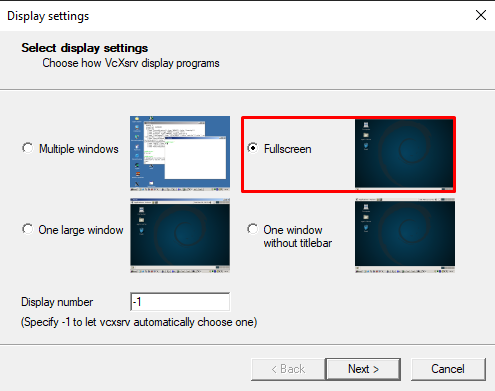
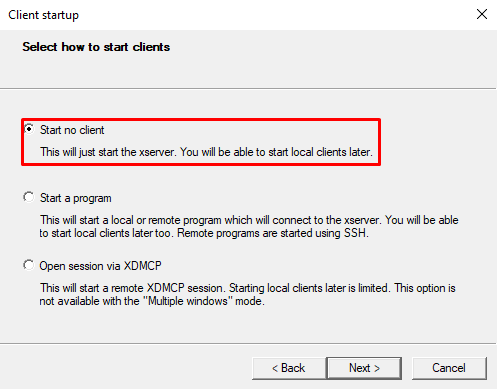
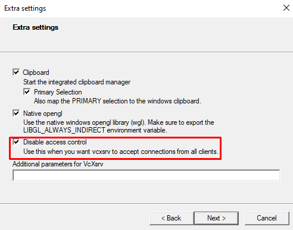

Using `i3` and `Ubuntu` native is probably best, but you may not get the choice to do so, in case your working machine is running Windows.
I looked through several guides how to set up Ubuntu with `i3` on WSL2, but it took me several hours to get the setup I looked for because things did not work as expected.
Therefore I'm writing this guide.

## Installing Ubuntu on WSL2

There are plenty of tutorials and videos to do so.
I will refer to the very one that I used to set up the bare, GUIless minimum,
[WSL2 Ubuntu GUI](https://www.youtube.com/watch?v=IL7Jd9rjgrM) by David Bombai.
Reproduce the steps until `Install Ubuntu GUI` (7:25) to get the headless Ubuntu on WSL2 up and running.

## Installing i3 and VcXsrv

Once you set up your Ubuntu, created a user and are prompted with the shell, update the package index.

```bash
sudo apt update
```

Next, install `lxdm` and `i3`.
We also need to provide the information where Xserver sends its signals to.
This is done by specifying the `DISPLAY` environment variable in `.bashrc`.
The echo command adds this.

```bash
sudo apt install -y lxdm i3
echo "export DISPLAY=\$(cat /etc/resolv.conf | grep nameserver | awk '{print \$2; exit;}'):0.0" >> ~/.bashrc
```

After you setup all this, restart Ubuntu (e.g. run `exit` and then start it again).

Next, install [VcXsrv](https://sourceforge.net/projects/vcxsrv/).
Once installed, in your installation directory (default: `C:\Program Files\VcXsrv`) start `xlaunch.exe`.
Launch it with the parameters provided in the screenshots.



Select `Fullscreen`, then click `Next`.



Select the option `Start no client` and click `Next`.



In `Extra Settings`, select `Disable access control` and click `Next`.

You will be presented with the final setup screen and don't need to do anything here.
Click `Finish` and your screen should turn black, because VcXsrv opened a fullscreen window with no clients attached.
Press `Alt-Tab` to tab out the window, and go back to your Ubuntu terminal.

In your Ubuntu terminal, run `i3` (i.e. type `i3` and press enter) and you should start seeing some log (maybe including error messages).
When you now tab back into the black fullscreen, after waiting a short time you should be able to select your i3 config.
It doesn't matter whether you run the config setup or not, for some reason it won't be properly persisted.
Thus, we need to "restore" the original config.
Exit VcXsrv and go back to the Ubuntu console.
If i3 hasn't terminated, press `CTRL+C` to close it.

Run the contents of this [MisterDerpie/i3-default-config-alt-key](https://gist.github.com/MisterDerpie/ddc2fa34ed76a65141a5913e0a2c9365) gist in your Ubuntu shell.
This you can do by copying the content and right-click into the Ubuntu window.
It will create the proper i3 configuration needed for your next connection.

Restart Ubuntu and restart VcXsrv (with the previous parameters).
When you now run `i3` again, go to `VcXsrv` you should see everything working.

## Extra: Oh My Zsh

As I'm a very happy user of [Oh My Zsh](https://github.com/ohmyzsh/ohmyzsh), and you may use it too, installing and making it the default shell would cause the `DISPLAY` variable to stop being defined.
This is because it's part of `.bashrc` and not `.zshrc`.

Assuming you don't have Oh My Zsh installed yet, below script will do the job.

```bash
sudo apt install -y git zsh
sh -c "$(curl -fsSL https://raw.githubusercontent.com/ohmyzsh/ohmyzsh/master/tools/install.sh)"
```

Once installed, issue below command to reenable the proper definition of the `DISPLAY` environment variable.

```bash
echo "export DISPLAY=\$(cat /etc/resolv.conf | grep nameserver | awk '{print $2; exit;}'):0.0" >> ~/.zshrc