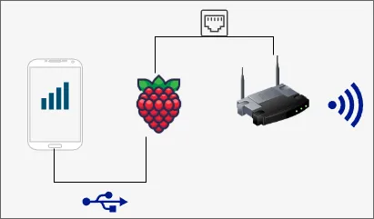
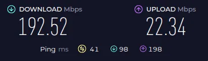

---
title: iPhone Ethernet bridge on RaspberryPi with Ubuntu Server
description: >
    This guide shows how to set up an iPhone to Ethernet bridge on the Raspberry Pi.
    Instead of Raspbian, this is a guide for Ubuntu Server.
slug: 2025-iphone-ethernet-bridge-rpi-4-ubuntu
date: 2025-05-11 08:00:00+0000
categories:
    - Tech
tags:
    - Linux
    - Ubuntu
    - RaspberryPi
weight: 1
---

This post covers how to tether your iPhone via USB to your RaspberryPi, and share the iPhone's network on `eth0`.
Eventually, the RaspberryPi will be connected to a router via ethernet, making the router use the iPhone's internet connection.
A RaspberryPi 4B is used, but this guide _should_ work on other models too.



One may wonder why this setup is needed.
Routing at least DNS traffic through the Pi with the [Pi-hole](https://pi-hole.net/) is a common use-case, but all traffic less so.

My connection to the world is through the iPhone's hotspot.
Said hotspot turns invisible after a period of time.
It is not the classic hidden SSID invisible, but connecting to it once invisible is impossible, only connected devices stay.

Still, why use a router, when the RaspberryPi comes with a WLAN chip?
About a month ago, I attempted a similar setup and had the Pi directly as a WiFi hotspot.
Unfortuantely, the throughput was only about 40 Mbit, defeating the purpose of the iPhone's 300 Mbit 5G connection.

Given the fact that my RaspberyPi was collecting dust, it was perfectly suited.
Moreover does my router at hand not support a USB connection, hence the need.

## Installing Ubuntu Server

To install Ubuntu Server, you may use the RaspberryPi Imager.
It can be downloaded from [raspberrypi.com/software](https://www.raspberrypi.com/software/).

During the installation, it will ask you to provide a custom configuration.
Choose yes and provide a username and a password to be able to SSH into it during the next steps.
Then install it.

Once done, start your RaspberryPi and connect it via ethernet to your router.

## RaspberryPi Internet Setup

Find the RaspberryPi's IP Address from your router.
Usually, it is listed under connected devices.
Then ssh into it, e.g.

```bash
ssh name-you-chose@192.168.X.Y
```

SSH probably asks you to trust the fingerprint, and you may select yes.
Note: In case you need to factory reset your Pi, and it gets assigned the same IP, you will see an error from ssh.
That is due to not matching fingerprints.
Remove the entries of that IP from `~/.ssh/known_hosts`.

### Connect to the iPhone

Install the packages

* [usbmuxd](https://github.com/libimobiledevice/usbmuxd)
* [libimobiledevice-utils](https://github.com/libimobiledevice/libimobiledevice)
* `ipeth-utils` (this may be optional, I didn't try it without)

```shell
sudo apt install -y \
    usbmuxd \
    ipheth-utils \
    libimobiledevice-utils
```

Now it is time to connect our iPhone.
With Mobile Hotspot enabled, it will show a dialog to Trust/Not trust the RaspberryPi.
Trust it, and you may be required to enter your password.

We can see that it's connected on the RaspberryPi running 

```shell
networkctl
```

```text
IDX LINK            TYPE     OPERATIONAL SETUP
  1 lo              loopback carrier     unmanaged
  2 eth0            ether    routable    configured
  3 wlan0           wlan     off         unmanaged
  4 enxfae5ce082148 ether    off         unmanaged
```

**Important: Your iPhone will have a different ID, and in the steps from here on you need to replace it in the provided snippets.**

The iPhone is `enx...`, and the next step is to have it managed, so it gets an IP assigned and we can route traffic through that interface.
At this point, the guide deviates slightly from [Arch Wiki's setup using systemd-networkd](https://wiki.archlinux.org/title/IPhone_tethering#Using_systemd-networkd).
Although one may set it up that way, Ubuntu Server ships with netplan, which we take advantage of. 
That way, we only need to configure netplan.

There should already be an entry for `eth0`, so you may only add the part for the iPhone.

```shell
sudo vim /etc/netplan/50-cloud-init.yaml
```

```yaml
network:
  version: 2
  renderer: networkd
  ethernets:
    enxfae5ce082148:    // Add this
      dhcp4: true       // Add this
// ... keep eth0 unchanged for now
```

Apply the new network config.

```shell
netplan apply
```

We can confirm it using the ip command.

```
ip a
```

```
4: enxfae5ce082148: <BROADCAST,MULTICAST,UP,LOWER_UP> mtu 1500 qdisc fq_codel state UP group default qlen 1000
    link/ether aa:bb:cc:dd:ff:gg brd ff:ff:ff:ff:ff:ff
    inet 123.12.10.4/28 metric 100 brd 123.12.10.15 scope global dynamic enxfae5ce082148
       valid_lft 86357sec preferred_lft 86357sec
    inet6 1111:1222:333:4444:5555:6666:7777:8888/64 scope global mngtmpaddr noprefixroute
       valid_lft forever preferred_lft forever
    inet6 1111::2222:3333:4444:2148/64 scope link proto kernel_ll
       valid_lft forever preferred_lft forever
```

To test the connection, curl provides the option to set an interface through which to connect.

```
curl --interface enxfae5ce082148 \
   https://example.com \ 
    -w '%{speed_download}' -o /dev/null
```

Great, now you could use the iPhone's USB tethered network to connect to the internet.

### Route traffic through the iPhone

The second part is to tell iptables to route traffic through our iPhone's interface.
It is done with adding this entry using the iptables command.

```shell
iptables -t nat -A POSTROUTING -o enxfae5ce082148 -j MASQUERADE
```

Note that the newly created entry is not persisted on reboot.
To persist it, one solution is to use `iptables-persistent`.
Whilst installing, it asks you to back up existing configurations.
Answer "Yes".

```shell
sudo apt install -y iptables-persistent
```

You will be able to confirm a `MASQUERADE` entry running

```shell
cat /etc/iptables/rules.v4
```

In case the entry is not present, rerun the steps and the persistence

```
sudo iptables-save > /etc/iptables/rules.v4
```

We still need to enable IP forwarding between interfaces.
This is achieved adding the following configuration.

```shell
sudo vim /etc/sysctl.d/30-ipforward.conf
```

```text
net.ipv4.ip_forward = 1
```

Last but not least, we must be able to connect on eth0.
I did not get into the steps of setting up DHCP on it, so you may do that yourself.
After this step, it will be assigned `192.168.42.1`.

```shell
sudo vim /etc/netplan/50-cloud-init.yaml
```

```yaml
network:
  version: 2
  renderer: networkd
  ethernets:
    enxfae5ce082148:
      dhcp4: true
    eth0:
      dhcp4: false
      addresses:
        - 192.168.42.1/24
```

From here on, for connecting to your RaspberryPi on `eth0`, you will need to assign the external device (e.g. a Laptop) a correct IP address, the right net mask and the right gateway.
Note that the IP address suffix must be a value between 2 and 254.

Given our setup, the configuration is

| Type       | Value               |
|------------|---------------------|
| IP Address | 192.168.42.X        |
| Gateway    | 192.168.42.1        |
| Netmask    | 24 or 255.255.255.0 |

Reboot the RaspberryPi, and the changes take effect.
Keep in mind that you <u>must</u> assign the IP on your external device like above table, otherwise you will not see the RPi.

The Pi can be accessed at `ssh your-name@192.168.42.1` thereafter.

## Using the RaspberryPi with a Router

The final step of this setup is to use the RaspberryPi as the internet provider for a router.
Across most routers, these steps are almost identical, and you may consult your router's documentation on where to find the right setuppage. 

First, you need to connect your RaspberryPi to the port of the router that says "WAN".

Then you need to find out where you can set the Conenction Mode/Internet Connection type of your router.
Provide the values as below, and your router should be able to connect to the RaspberryPi, and use its network.

| Type                 | Value         |
|----------------------|---------------|
| Connection Mode      | Static IP     |
| IP address           | 192.168.42.77 |
| Subnet Mask          | 255.255.255.0 |
| Default Gateway      | 192.168.42.1  |
| Primary DNS server   | 9.9.9.9       |
| Secondary DNS server | 8.8.8.8       |

---

The resulting speed with this setup is ~190 Mbit downloading, and 22 Mbit uploading.
With a different USB cable, I only achieved 120 Mbit, so the last 120 Mbit may be due to the USB cable.



Connecting to the iPhone directly gives me almost 300 Mbit, so there is definitely a loss of performance somewhere.
