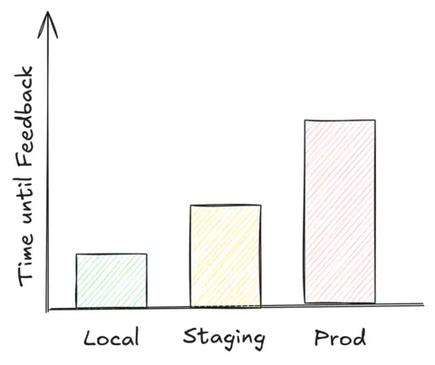
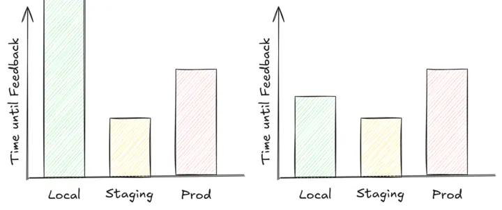
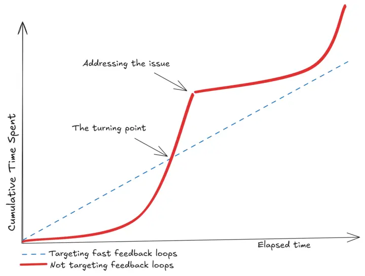

This post has been lying around as an idea for a couple of months now.
A list of bullet points on my computer is from somewhere mid-June, and I originally intended to title it *"The Underappreciation of Fast Feedback Loops"*.
However, calling out a cost sounds catchier and is more accurate, because we do not only underappreciate them, but they cost us.
First and foremost, nerves (because who likes to wait for results?), but moreover do slow feedback loops actively reduce delivery speed of teams.

In Software Engineering, we easily set targets around metrics and processes which have a constant behavior, regardless of whether we have 50, 300 or 50,000 lines of code. 
At the same time, we do not pay close attention to those metrics that change as complexity grows, and only realize their impact when the pain is obvious.

## Why do we accelerate cars to high speed before we turn on the engine?

We don't do this.
Reading this headline, you might be wondering "What on earth are you talking about?"
Worry not, the post is still about software, we're getting there.

### A time consuming design

It's a sunny day in a ~~utopian~~ dystopian world, and you bring your car in for inspection.
At the end of the inspection, you see it being towed out of the workshop, straight onto the highway.
The towing car accelerates to a speed of 100 km/h (62 mp/h), and then the key in your car is turned and the ignition kicks in.
From that point on, the engine is running.
Great, they've **verified that the engine works**!

### Why would you do this?!

Coming from our real world, you naturally ask 
_"Why do you need to accelerate to a high speed, if you want to know whether the engine turns on?"_
Fair question.
_"Can't you just turn the key with the car standing still?"_
Absolutely.
_"Why does it need to be on the highway and at a high speed to verify that the engine starts?"_
Right, why?

### We keep building our own limitations

You might get an idea now where I am heading to.
What if, in this fictional world, the car was built in such a way that it **must** accelerate to a high speed after an inspection, before the engine can be turned on.
It is very obvious that this is a an additional cost and a waste of time, as inspections take much longer.

Let me ask you this:
How often have you heard the sentence "We need to deploy this to {somewhere} to verify whether it works."
Do you think that deploying your application somewhere is really necessary, to see if your change behaves as expected?
Now is the time to ask yourself: Why don't we test this locally?
And I am quite sure, you have heard all kinds of excuses around complexity and dependencies.
You won't need a highway and a car being towed to high speed to turn on the engine, and your application should not need a fully-fledged environment to verify its behavior.

## The Development Feedback Loop

During the development of a feature, a simplified feedback loop until done looks as follows:

1. Change Something
2. Verify - If it does not yet behave as expected, back to 1
3. Done.

Once the Verify step actually yields your expected results, be that automated or manual, you move on and consider it done.

### Theoretical Ideal

It is important to understand the implication of where the feedback can be gathered, and how much time each approach takes.
In an ideal world, it should look like above.

Normally, being able to gather feedback locally is the fastest.
An engineer only needs to rebuild their feature, maybe have a set of dependencies running on the side, and thus is entirely independent on other systems to verify correctness.
If the feedback turns out to not be what they expect, a rebuild happens seemingly fast.

Second in line is a staging (also _testing_) environment.
Usually, within this environment all dependencies are present.
However, it is not that simple as just recompiling the feature and testing it, given this is not on our machine anymore.
To test changes in the staging environment, that change must somehow get there.
The actual steps involved depend on the environment, yet due to its nature of needing more steps, the time until feedback can be collected increases.

Last but not least, what if it can only be verified in the actual production environment that hits real traffic?
Regardless of whether it's dangerous to test there or not, it tends to take the most time to get the change out there.
Often, one also has to be precautious and apply additional measures, for example the use Feature Flags, to make sure not to impair existing flows.

If you're manufacaturing an engine, after its assembly, you do not want (nor need) to build a car around it to verify that the engine works.

### Feedback Loops in Practice

From working in several teams across various companies, and talking with peers in the field, the reality actually more often than not looks like this.

In the first graph, the time to gather feedback on the local machine is infinite.
This should depict the absence of a local environment, so there is no way to verify changes locally.
The second graph indicates that gathering feedback locally is more time consuming than gathering it in staging.

Teams tend to either not have a setup to have a (reliable) local feedback loop, or if they do, it is slower (maybe more fragile) than deploying their application to a different environment.
This is often excused with having too many dependencies to do this.
Whilst there are certainly dependencies that we may not easily replicate locally, we need to keep in mind that **at the beginning of every software project, the amount of dependencies is zero**.
Our projects do not get in a hard-to-locally-verify state out of nowhere, and the fact of "too many dependencies to resolve" comes from not having resolved one-by-one at the time of their introduction.

### A Self-Inflicted Problem

One may wonder now, if testing locally involves the least hoops to jump, how do projects end up in a state where testing in a different environment ends up being faster?
This is the software equivalent of the Boiling Frog.


The **boiling frog** is an apologue describing a frog being slowly boiled alive.
The premise is that <u>if a frog is put suddenly into boiling water, it will jump out</u>, but if the frog is put in tepid water which is then brought to a boil slowly, it will not perceive the danger and will be cooked to death. 


When we join a new team, we immediately notice the things that do not work very well.
Especially if we come from teams where we took those things for granted.
Right here, that is the degradation of the feedback loop.
With every dependency pulled in, and every feature that needs to get shipped faster, it is very likely that the feedback time decreases.
Since we are part of the process, we do not notice it.
Much like your relatives telling you _"You have grown quite a lot since last time we saw you!"_, although you don't actively notice any difference day-to-day.
Most often, teams do not put the effort in keeping local verification easy enough when they add new features.
This _debt_ accumulates, and will be paid at some point, but only noticed once it becomes too painful and too much of a drag to keep shipping fast.

### Where are the targets?

If you have seen "The Office", Michael Scott screaming "Where are the turtles?!" might be a scene stuck to your head.
Given the boiling frog situation of the feedback loop, I come to wonder: Where are the targets?

We tend to track many things in software projects, probably a metric all of us are familiar with is Code Coverage.
That is, how many statements of your code are executed during an automated test run.
On GitHub, you most likely have encountered at least one repository throughout your life that used [CodeCov](https://about.codecov.io/).
For code coverage, we don't lightheartedly accept changes that will lead to a decrease below a certain threshold.

When it comes to delivery speed, Velocity ([Wikipedia](https://en.wikipedia.org/wiki/Velocity_(software_development)))
and Lead Time ([Wikipedia](https://en.wikipedia.org/wiki/Lead_time)) are terms that pop up.
Velocity describes how much time tasks of similar complexity take, whilst lead time denotes the total time taken from requesting a feature to its eventual delivery.
At some point, when the feedback loop is so unbearably slow, the team's velocity decreases.
And given that the lead time is directly depending on velocity, so will the team end up consuming more time on delivering results.

Whilst it is accepted for teams to have a target on Code Coverage, and not accept changes that breach a certain threshold, we do not really set up a target of "How much time something should take to verify".
If we had that target, it would be expected that engineers spend time during their feature development on keeping the feedback loop short and healthy.
Sure, this would have a constant impact on the team's velocity for any task, however, it avoids teams ever getting into a situation that is so bad that it is hard to recover.
Think about a code base with 100,000 LoC, without any tests.
It is unlikely that anyone will ever sufficiently retrofit any sort of automated testing into that code base, without bringing the team's feature delivery to a grinding halt ... for months to come.
Strangely enough, it is widely accepted across the industry to take slightly more time by adding a set of automated tests for each task.

## The Hidden Cost of Slow Feedback Loops

### Delivering with n-1 Engineers

To support my point and underline the headline, let's look at numbers.
Whilst I have claimed that slower feedback loops are counterproductive, it still remains to show what the hidden cost is.
Note that this is a constructed scenario, and on a one-team level this may not reflect reality well enough.
However, taken a large enough organization, the results converge towards the outlined example.

Assuming we are having a team of 8 engineers and a feedback loop where locally testing is the fastest, that is, the ideal situation.
Over the course of the year, the team adds new features but neglects to keep local verifiability fast.
Therfore, they start deploying their changes to a staging environment for any verification.
Compared to a year ago, an engineer now needs to spend 10 extra minutes per verification attempt.
Say each engineer needs to do that 6 times per day.
Let's do the math:

$$
\begin{aligned}
&= 8 \,\text{Engineers} \times 10 \,\frac{\text{Minutes}}{\text{Run}} \times 6 \,\frac{\text{Runs}}{\text{Engineer/Day}} \\
&= 480 \,\frac{\text{Minutes}}{\text{Day}} \\
&= 8 \,\frac{\text{Hours}}{\text{Day}} \\
&= 5 \,\frac{\text{Days}}{\text{Week}}
\end{aligned}
$$

The absence of a fast feedback loop results in the team losing the capacity of a full time engineer.
That team manages to get the work of 7 done with the capacity of 8.
Usually not the "Buy 2 get 3" kind of deal you would like to have.

### Cumulative Debt

One may make an argument against that, that if we were to constantly add time for keeping feedback loops fast, we end up with the same velocity.
On the surface, that looks to be a zero-sum game.

In practice, there is a turning point in which the constant effort put into keeping them fast will be overtaken by the slowdown of never addressing them in the first place.
With new projects, this trend takes a long time before it sets in.
However, once slow enough, it overtakes the linear growth, and from there on will be net-negative until resolved.
Given time usually being accounted for feature delivery already, the time where this gets addressed might be far in the future.

## Bottom Line

To finish this article, I'd like to suggest teams to invest more time into fast feedback loops.
As an anecdote, I once joined a product where colleagues needed to deploy software to a staging environment, just to verify that their new GET endpoint, reading a record from a database and returning it, works as expected.
After questioning this and being told "But it's too hard, there are too many dependencies to do this locally", I spent some time to build the local feedback loop, which was eventually adopted by the whole team.
For the sake of numbers, the actual time it took to verify was ~20-30 minutes per attempt before the change made, whilst the local setup took precisely the compile time and issuing a request, so less than a minute.

If you find yourself in the situation where seemingly simple tasks like this vary a deployment, stop adding yet another feature and address local verifiability.
It's worth it.
