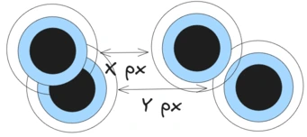
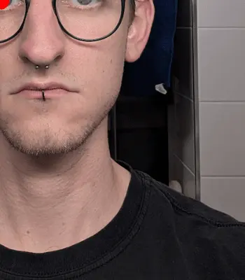
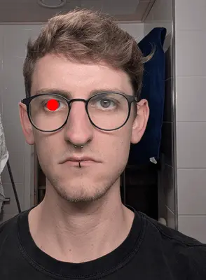

Every year No Shave November and Movember are held to raise funds and spread awareness for Men's Health, particularly cancer research and treatment.
They are more or less the same, but not exactly.
[Movember vs No Shave November (tue.nl)](https://www.cursor.tue.nl/opinie/harsh-jethwani/movember-vs-no-shave-november)
provides a more detailed view of their differences.
The idea is simple:
Do not spend your money on a barber for the whole of November, instead donate it to a good cause.

You can find more information about either of them at

* [movember.com](https://movember.com/)
* [no-shave.org](https://no-shave.org/).

## Motivation for this Post 

Year after year, I let my beard grow for the whole November, and at best take one selfie at the end of it, to compare with the previous year.
This year though, I took one every day, and wanted to create a GIF showing the progress of my measly beard growth.
As the selfies are not taken on the exact same spot nor with the same angle, the face is slightly off on every picture, and furthermore has a different size.
To create a GIF where the face is aligned and scaled, I could probably use GIMP, Photoshop or the likes.
However, why putting in the effort to manually align 30 pictures, when machines could do the job?
After all, we're not working in the software industry to make our lives harder, but easier.

## The Idea

Its a rather simple idea (and there are probably better ideas) on how we can align the pictures.
Our face has several reference points.
The eyes, the nose, the mouth and ultimately, if we find the outline of our face, we know what to scale.

As it turns out, the outline is not all too great, because depending on hair and lighting, this can easily be too skewed.
Also, using the mouth risks that if there is a smile in one, but a rather grim look in another picture, the size is incomparable.
Maybe the nose could work, however, the eyes turn out to be the perfect reference point(s).

First and foremost, our eyes don't change (too much).
The distance between them is always the same in our face.
Moreover do they have a perfect center, the pupil, which at worst change light due to lighting, yet that is irrelevant to our use case.
As long as you look straight, its position is quite static.
Another rather great benefit is that we have a **pair** of eyes, hence two points to rely on.

### Idea on Scaling Faces to the Same Size


Take a look at the picture above.
Two different pictures may have the distances `x` and `y` between the eyes, respectively.
Given that the camera is not static, it is sometimes closer, sometimes farther away, and therefore the distance is not the same in each picture.
Scaling the pictures such that the resulting distance is, say `150px`, the faces should be more or less the same size in each picture.

### Idea on Aligning Faces



A second problem to solve is to align the eyes.
Two pictures may have the eyes in a different position, so at some point, we need to move the eyes to be overlapping.
As you will see in the implementation, instead of translating the image to move it around, we can achieve this by cropping it.
This is a lot easier and can save us some headache.

## Implementation Using Python and OpenCV

Given its stance in computer vision, and ease of programming, we use Python.
First we have a look into face detection and will see some pitfalls encountered along the way.
Then we dive into scaling the picture, and afterwards align it.

On a side note:
There is a difference between face detection and face recognition.
The former, and what we do in the post, is simply to find the position of/presence of faces in pictures,
whilst the latter is about identifying the same face across multiple pictures.

### Detecting the Face

When you use Google to find out how to detect faces in images, the first hits are OpenCV and the Haar Cascade classifier.
That may or may not be the best choice, but certainly the easiest available, so we settle with that.
As this post is rather focused on the actual application, you may want to have a read up on how they work in [Haar Cascades Explained (medium.com)](https://medium.com/analytics-vidhya/haar-cascades-explained-38210e57970d) by Aditya Mittal.

Assuming we have Python installed, we need to install OpenCV 2.
_I use Arch, btw_, so Python and its packages are managed through pacman, rather than pip.

```shell
# Arch users
sudo pacman -S python-opencv
```

If you're on a system using pip, install the package [opencv-python (pip)](https://pypi.org/project/opencv-python/)

```shell
# pip users
pip install opencv-python
```

The first thing we need is our classifier.
With the OpenCV repository comes a set of public classifiers, which you can download and use.
See [GitHub/OpenCV/haarcascades](https://github.com/opencv/opencv/tree/8fb0b7177fc082bc726bb8739dc035baf8393b95/data/haarcascades).

Although we want to detect the eyes, we should detect the face first.
The explanation for that is rather simple.
Our face is a large structure inside a selfie, but the selfie may have many objects that _could_ be interpreted as eyes.
We get to see the implication of that in a bit, quite literally.
However, it is unlikely that a selfie has multiple objects that look face-alike.
So once we detected it, we can reduce the search space for eyes to be only within the face.

To detect the face, we are using [Haarcascade Frontalface Default (GitHub)](https://github.com/opencv/opencv/blob/master/data/haarcascades/haarcascade_frontalface_default.xml).
Download the file and place it to where your code is located.

#### First Attempt

```python
import cv2

# Load the face classifier
face_cascade = cv2.CascadeClassifier('haarcascade_frontalface_default.xml')

# Load the image
image = cv2.imread("/path/to/image.png")

# Turn image into grayscale
gray = cv2.cvtColor(image, cv2.COLOR_BGR2GRAY)
    
# Detect faces
faces = face_cascade.detectMultiScale(gray, 1.3, 5)

# Print the found face
print(faces)
```

First we load the classifier, then we load the image.
Those parts should be clear.
We then convert the image into grayscale, which is simply to reduce the bit per pixel.
Whilst a colored image has Red, Green and Blue represented with 8 bit respectively (=> 24 bit/pixel), a grayscale image may only store 8 bit per pixel, indicating how "bright" it is.
For further explanation, see [When to Use Grayscale as a Preprocessing Step (roboflow.com)](https://blog.roboflow.com/when-to-use-grayscale-as-a-preprocessing-step/).

Another point is that the training data for OpenCV's classifiers _may_ has been in grayscale too.
Unfortunately, I could not find the dataset they used, but this guide on [Cascade Classifier (opencv.org)](https://docs.opencv.org/4.x/db/d28/tutorial_cascade_classifier.html) uses grayscale images in their examples.

Last but not least, we run the detection using our Cascade classifier, providing the image, the _scale factor_ and the _min neighbors_.
I am unfortunately in no position to explain these, so for curious readers, please read up on them at e.g.
[detectMultiScale (opencv.org)](https://docs.opencv.org/4.12.0/d1/de5/classcv_1_1CascadeClassifier.html#aaf8181cb63968136476ec4204ffca498),
[How does the parameter scaleFactor in detectMultiScale affect face detection (opencv.org)](https://answers.opencv.org/question/10654/how-does-the-parameter-scalefactor-in-detectmultiscale-affect-face-detection/)
and
[OpenCV detectMultiScale() minNeighbors parameter (stackoverflow.com)](https://stackoverflow.com/questions/22249579/opencv-detectmultiscale-minneighbors-parameter).

You may have wondered why the is called _face<u>s</u>_, and not just a single _face_.
The Cascade Classifier - ideally - detects all faces in a picture.
Looking at a selfie with only one face and a wall in the background, it unfortunately finds multiple faces though.

```
[[ 610 1155 1465 1465]
 [  51 2599  151  151]
 [ 101 1984  166  166]]
```

#### Scale Matters

Before we go into detail why that is the case, let's add some more code to visualize the found face and draw a rectangle around it.

```python
for face in faces:
    # Face is stored as the rectangle [x, y, width, height]
    x = face[0]
    y = face[1]
    w = face[2]
    h = face[3]

    # Draw rectangle around it
    cv2.rectangle(image, (x,y), (x+w, y+h), (0,255,0),2)
```


What's that?
There is clearly only one face in the picture, however, we seem to detect three.
The simple answer is that the model has been trained on much, much smaller images.
My original selfie is 2736x3648 pixels, but oftentimes the training data is (way) less than 500x500 pixels.
Therefore, within an image that large, it is not all too surprising to detect multiple faces.

#### Second Attempt

There is an easy fix for that: We scale the image down before we search for a face.
This should avoid a lot of false-positives, as with smaller images, the amount of details in my towel should vanish, such that only the face will be recognizable as such.
Going with 1/10th of the original size suffices to be left with only one face.

```python
image = cv2.resize(image, (0, 0), fx=0.1, fy=0.1)
```


> Note: In the final code, you will see that I use 1/3rd of the original picture and only consider the first result of the face detection.
At this input size (~1000x1000) it still is not small enough to be precise.
However, the multi face detection seems to always return the biggest area first _on my machine_, and therefore this sufficed my needs.
The correct approach would be to scale down to find only one face, and then calculate the respective x, y, width and height in the original image, which is to simply multiply the found values by 1/{scaling factor}.

### Detecting the Eyes

Now that we found our face, we continue with detecting the eyes.
The code ia almost identical, except now we have to use the classifier for eye detection.
If you happen to wear glasses on your pictures, use the [haarcascade_frontalface_default.xml (GitHub)](https://github.com/opencv/opencv/blob/master/data/haarcascades/haarcascade_eye_tree_eyeglasses.xml).
Otherwise, go with [haarcascade_eye.xml (GitHub)](https://github.com/opencv/opencv/blob/master/data/haarcascades/haarcascade_eye.xml).

```python
# Load eye cascade
eye_cascade = cv2.CascadeClassifier('haarcascade_eye_tree_eyeglasses.xml')

# Use x, y, width and height from face as search area
face_img = image[y:y+h, x:x+w]

# Detect eyes
eyes = eye_cascade.detectMultiScale(face_img)
print(eyes)

# Draw rectangle around the eyes
for eye in eyes:
    eye_x = eye[0]
    eye_y = eye[1]
    eye_width = eye[2]
    eye_height = eye[3]

    cv2.rectangle(
        image,
        (x+eye_x,y+eye_y),
        (x+eye_x+eye_width, y+eye_y+eye_height),
        (0,255,0),
        thickness=5
    )
```

Given we already know the face's area, we need not scan the whole image.
Hence we crop it to the original area of the eyes (the rectangle from the previous picture).
Again we end up with an array of x, y, width and height.

```
[[ 88 134  85  85]
 [252 122 103 103]]
```

We need to take into account that these values are relative to the rectangle of the face.
That is, `x=88` for the first eye is based 88 pixel of the face's x, <u>not</u> off of the image's root.
Remember, we cropped our image to reduce the search space, but the classifier does not know that this is part of a bigger image.
Thus, to get our real coordinates, we need to offset the face's x and y.
The result looks satisfying.


Note that these rectangles are slightly different in size (roughly 20px, as you can see on the returned array).
For our use case, that is perfectly fine, as we're interested in the eyes' center only.
Even if we were to scale that rectangle 10x, the center point would only change by a margin of error.

### Scaling the Face

Let's quickly recap this image from the start of the post.


Our task is to ensure that the distance between the eyes on all output pictures is the same.
So if we were to align them one above another, the left and right eye in each picture should perfectly overlap.

#### Finding the Center Points 

This part is fairly simple.
We have our rectangle, and its center point is precisely x + 1/2 its width, and y + 1/2 its height.
For better visualization, from here on we stop drawing the rectangles around the face and eyes.

```python
center_x = x + eye_x + (eye_width / 2).astype(int)
center_y = y + eye_y + (eye_height / 2).astype(int)
cv2.circle(image, center=(center_x, center_y), radius=3, color=(0,0,255), thickness=25)
```


#### Scaling to a Fixed Distance

Although the eyes are not aligned perfectly on the vertical axis, for simplicity we can ignore that, and only focus on scaling along the horizontal axis.
To do so, the distance between the two eyes is determined by subtracting the right x from the left x.
Note that we use the absolute, as we do not care (for now) about which eye is left or right.

```python
# Create a list to append the eye's center x
eyes_center_x = []

for eye in eyes:
    # ... previous code for detection
    eyes_center_x.append(center_x)

eye_distance = abs(eyes_center_x[0] - eyes_center_x[1])
```

With my input image (note that it was already scaled that down by 1/3rd), I get 173px to be the distance in this picture.
From experimenting around a bit, it turns out that an ideal distance for the _output_ picture is 150px.

The math to scale is fairly simple.
We're looking for a scaling factor `sf` such that `173px * sf = 150px`.
Applying _[two plus two is four minus one that's three quick maths (knowyourmeme.com)](https://knowyourmeme.com/memes/mans-not-hot)_,
we get 

```python
# sf = output_distance/actual_eye_distance
sf = 150/eye_distance
```

The last missing step is to resize the image by that scaling factor.

```python
image = cv2.resize(image, (0, 0), fx=sf, fy=sf)
```

### Aligning the Face

Our face should be aligned based on the left eye.
For scaling, we did not care which is the left or right eye, for alignment this is important though.
Luckily, its fairly easy, if we just find the eye with the leftmost x.
Therefore, we introduce a function that given a pair of eyes returns the center of the left eye.

```python
def left_eye_x_y(eyes):
    if eyes[0][0] < eyes[1][0]:
        return [(eyes[0][0]+(eyes[0][2]/2)).astype(int), (eyes[0][1]+(eyes[0][3]/2)).astype(int)]
    else:
        return [(eyes[1][0]+(eyes[1][2]/2)).astype(int), (eyes[1][1]+(eyes[1][3]/2)).astype(int)]

left_eye = left_eye_x_y(eyes)
```

**Important:** The position of the eyes is from the **unscaled** image.
So is the face's position too.
Before we can proceed, we first need to also "scale" our coordinates for the left eye.
This is achieved by multiplying our coordinates with `sf`.

```python
left_eye = (
    ((x+left_eye[0])*sf).astype(int),
    ((y+left_eye[1])*sf).astype(int),
)
```

To align the face, there are at least to ways.
The first is to translate the image, which means to move it along the axes.
Image translation with OpenCV is unfortunately not a oneliner of `image.move(x, y)`,
see [Image Translation (opencv.org)](https://opencv.org/blog/image-rotation-and-translation-using-opencv/#h-image-translation).
Lucky for us, we can be cheap and just cut off the image at a specific offset.
This is equal to moving our input image to a specific coordinate.
In OpenCV, images are stored as an array of the form `image[height, width]`.
Let's start by cropping the image to the left eye's center.

```python
image = image[left_eye[1]:, left_eye[0]:]
```



That looks really promising!
Taking to pictures, after this step they would be perfectly aligned!
However, we obviously would not like to cut off our face, so we need to get a bit more from the left and the top.
These values are easiest found by trial & error.
For my purposes, using an offset of 300px vertically and 150px horizontally sufficed.

```python
image = image[left_eye[1]-300:, left_eye[0]-150:]
```



We don't need to have a look at the whole shoulder or the largest part of the neck.
So let's also crop the image to the bottom and to the right.
As before, the values are best determined by trial & error, until it looks good.
For my case, 630px in height and 475px in width deemed successful.

```python
image = image[
    left_eye[1]-300:(left_eye[1]-300)+630,
    left_eye[0]-150:(left_eye[0]-150)+475,
]
```


Take a moment to breathe.
We're done with all it takes to detect the face, the eyes, scale and align on the left eye, resulting in a nicely cut out image.
On to our next task, stitching images together ... and stop drawing the red circle in the eye.

The code up until here is available in [align_and_cutout.py](align_and_cutout.py).

## Generating the GIF

This section can be read independent of the previous section.
We will however extend the previous code and add to read the input images, produce the aligned output, and then stitch these output images together.

To generate the GIFs, we use [ImageIO (pypi.org)](https://pypi.org/project/ImageIO/).
As with OpenCV, as an Arch user _(btw)_ I use pacman to install it, but if you're using pip to manage your packages, use pip.

```shell
# Arch users
sudo pacman -S python-imageio
```

```shell
# pip users
pip install opencv-python
```

### Processing Input Images

For simplicity, we assume that there are two directories.
One is `input/` and one is `output/`.
All images in `input/` are named in a sortable order by their respective date, e.g. `20251101`, `20251102`, ...

```python
import os

input_path = "input/"
output_path = "output/"

files = os.listdir(input_path)
files.sort()

input_files = [(filename, input_path + filename, output_path + filename) for filename in files]
```

Next on, we need to iterate through all files and convert them using our previous code.

```python
for filename, fin, fout in input_files:
    # previously: image = cv2.imread("image.png")
    image = cv2.imread(fin)
    
    # . . . find face, eyes, scale, position, crop

    # previously: cv2.imwrite("output.png", image)
    cv2.imwrite(fout, image)
```

### Creating a GIF using ImageIO

This is **by far** the easiest part of this post.
We read all frames, append them to a list that the GIF should be generated from ... and generate it.

```python
import imageio.v2 as imageio

frames = []

# Our main loop from the previous step
for filename, fin, fout in input_files:
    # Reading, Processing, ..., and saving
    cv2.imwrite(fout, image)
    
    frames.append(imageio.imread(fout))

imageio.mimsave("output.gif", frames, fps=5)
```

The final code can be found in [final_result.py](final_result.py)

## Result and Closing Remarks

Of course, here is a result of 30 days not shaving:

<div class="gallery">
    <video src="output.mp4" controls loop muted></video>
</div>

The irony of providing this as an MP4 cannot be overlooked.
GIFs are way too chunky and would auto load, so I had to embed this as a video ...
However, the final result of this code is a GIF, _trust me bro_

This marks the end of my longest post, to date (2025).
Given I have zero stance in computer vision or machine learning, it's been a refreshing excursion into a different field.

Once again, I'd like to point out that more information around the Movember & No-Shave November can be found on

* [movember.com](https://movember.com/) and
* [no-shave.org](https://no-shave.org/).
